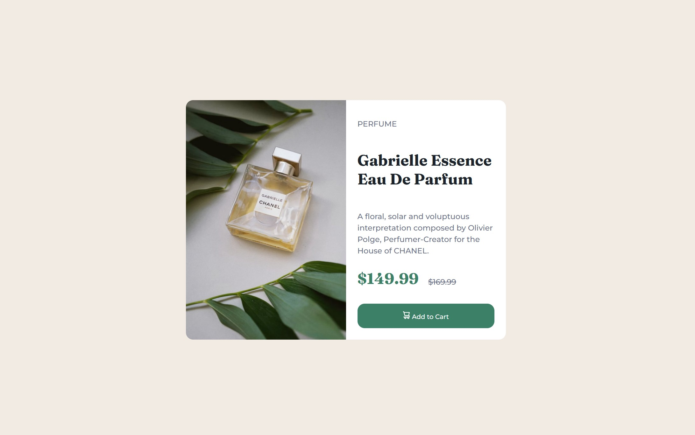

# Frontend Mentor - Product preview card component solution

This is a solution to the [Product preview card component challenge on Frontend Mentor](https://www.frontendmentor.io/challenges/product-preview-card-component-GO7UmttRfa). Frontend Mentor challenges help you improve your coding skills by building realistic projects. 

## Table of contents

- [Overview](#overview)
  - [The challenge](#the-challenge)
  - [Screenshot](#screenshot)
  - [Links](#links)
- [My process](#my-process)
  - [Built with](#built-with)
  - [What I learned](#what-i-learned)
  - [Continued development](#continued-development)
  - [Useful resources](#useful-resources)
  - [AI Collaboration](#ai-collaboration)
- [Author](#author)

## Overview

### The challenge

Users should be able to:

- View the optimal layout depending on their device's screen size
- See hover and focus states for interactive elements

### Screenshot




### Links

- [Solution URL](https://github.com/dulwn/product-preview-card-component-main)
- [Live Site URL](https://dulwn.github.io/product-preview-card-component-main/)

## My process

### Built with

- Semantic HTML5 markup
- CSS custom properties
- Flexbox

### What I learned

I learned a semantic tag thas is used for independent, self-contained content.
```html
<article></article>
```

I learned how to use Flexbox for adjusting layout and arranging elements. An HTML element that holds `display: flex` property becomes the flex container, while its direct children become the flex items. 
```css
display: flex;
flex-direction: column;
justify-content: space-between;
```

### Continued development

Having completed two challenges, I have built a basic foundation in core CSS syntax. Moving forward, I will continue tackling more Frontend Mentor challenges to put my new knowledge into practice. These projects will expose me to a wider range of CSS and HTML tools, layout structures, and styling techniques.

### Useful resources

Documentation hubs that helped me to review any uncertain CSS syntaxs are: 

- [mdn](https://developer.mozilla.org/en-US/) 
- [CSS tricks](https://css-tricks.com/)

### AI Collaboration

VS Code AI chat was used for:

- Providing direction on semantic HTML tagging and structuring class names before writing the styles.
- Reviewing and editing my initial code drafts, which allowed me to catch mistakes and understand how to write cleaner, more maintainable CSS.


## Author

- Frontend Mentor - [@dulwn](https://www.frontendmentor.io/profile/dulwn)


